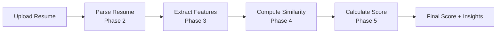

# 🎯 PHASE 5: Custom Resume Scoring Model (Interpretability Layer)

## 🌟 Project Vision

**"I designed the scoring logic myself instead of relying on a black-box AI - exactly what interviewers want to see!"**

Phase 5 implements a **transparent, explainable resume scoring model** that combines all extracted features (Phase 3) with semantic similarity (Phase 4) to produce a **final resume score (0-100)** with complete interpretability.

### Why This Approach Is Interview Gold 💎

- ✅ **Explainability**: Every score component is traceable and understandable
- ✅ **No Black-Box AI**: Custom algorithmic logic you can explain in interviews
- ✅ **Configurable**: JSON-based weights (no code changes needed)
- ✅ **Transparent Formula**: Weighted combination of normalized features
- ✅ **Professional**: Production-ready with visualizations and insights

---

## 📊 Scoring Formula

### Core Algorithm

```
final_score = (
    skill_match      × 0.40 +
    semantic_sim     × 0.25 +
    experience       × 0.20 +
    project_score    × 0.15
) × 100
```

### Default Weight Distribution

| Component | Weight | Reasoning |
|-----------|--------|-----------|
| **Skill Match** | 40% | Most critical - do they have the required skills? |
| **Semantic Similarity** | 25% | How well does resume align with job description? |
| **Experience** | 20% | Do they have sufficient experience? |
| **Project Score** | 15% | Do they have relevant project experience? |

**Total:** 100% (weights sum to 1.0)

---

## 🏗️ Architecture

### 1. Scoring Engine (`scoring_engine.py`)

**Purpose:** Calculate final resume score from normalized features

```python
from app.scoring import ScoringEngine

engine = ScoringEngine()

result = engine.calculate_score(
    skill_match=0.75,           # 75% skill match
    semantic_similarity=0.72,   # 72% semantic alignment
    experience=0.80,            # 80% experience match
    project_score=0.65          # 65% project relevance
)

# Result:
# {
#   'final_score': 74,
#   'interpretation': 'Good',
#   'emoji': '👍',
#   'recommendation': 'Strong candidate with solid qualifications',
#   'weighted_components': {
#       'skill_match': 30.0,        # 0.75 * 0.40 * 100
#       'semantic_similarity': 18.0, # 0.72 * 0.25 * 100
#       'experience': 16.0,         # 0.80 * 0.20 * 100
#       'project_score': 9.75       # 0.65 * 0.15 * 100
#   }
# }
```

**Key Methods:**
- `calculate_score()` - Calculate final score from 4 components
- `calculate_score_from_features()` - Convenience method accepting dict
- `explain_score()` - Generate human-readable explanation
- `get_weights()` - Get current weight configuration
- `reload_config()` - Reload configuration file dynamically

### 2. Score Breakdown Generator (`score_breakdown.py`)

**Purpose:** Generate visualization-ready breakdowns and actionable insights

```python
from app.scoring import ScoreBreakdownGenerator

generator = ScoreBreakdownGenerator(
    config_weights=engine.get_weights()
)

breakdown = generator.generate_breakdown(
    score_result=result,
    normalized_features=features,
    semantic_similarity=0.72
)

# Breakdown includes:
# - visualizations (pie, bar, radar, gauge, progress bars)
# - insights (strengths, weaknesses, recommendations)
# - metadata (timestamp, version)
```

**Visualization Types:**

1. **Pie Chart** - Component weight distribution
2. **Bar Chart** - Weighted scores vs normalized values
3. **Radar Chart** - Multi-dimensional skill view
4. **Gauge Chart** - Overall score meter
5. **Progress Bars** - Individual component breakdowns

**Insight Categories:**

- **Strengths** - High-performing components (>0.7)
- **Weaknesses** - Low-performing components (<0.5)
- **Recommendations** - Actionable improvement suggestions

### 3. Configuration File (`scoring_config.json`)

**Purpose:** Centralized, JSON-based configuration (no code changes)

```json
{
  "weights": {
    "skill_match": 0.40,
    "semantic_similarity": 0.25,
    "experience": 0.20,
    "project_score": 0.15
  },
  "interpretation_thresholds": {
    "excellent": 85,
    "good": 70,
    "moderate": 55,
    "weak": 40,
    "poor": 0
  },
  "penalty_rules": {
    "missing_critical_skills": {
      "enabled": false,
      "threshold": 0.3,
      "penalty": 10
    }
  },
  "bonus_rules": {
    "perfect_skill_match": {
      "enabled": false,
      "threshold": 1.0,
      "bonus": 5
    }
  }
}
```

**To Change Weights:**
1. Edit `scoring_config.json`
2. Restart API (or call `reload_config()`)
3. New scores use updated weights

---

## 🔌 API Integration

### Endpoint: `POST /api/calculate-score`

**Request:**

```json
{
  "normalized_features": {
    "skill_match": 0.75,
    "experience": 0.80,
    "project_score": 0.65
  },
  "semantic_similarity": 0.72,
  "include_breakdown": true
}
```

**Response:**

```json
{
  "final_score": 74,
  "interpretation": "Good",
  "emoji": "👍",
  "recommendation": "Strong candidate with solid qualifications",
  "weighted_components": {
    "skill_match": 30.0,
    "semantic_similarity": 18.0,
    "experience": 16.0,
    "project_score": 9.75
  },
  "breakdown": {
    "visualizations": {
      "pie_chart": {
        "labels": ["Skill Match", "Semantic Similarity", "Experience", "Projects"],
        "data": [30.0, 18.0, 16.0, 9.75],
        "colors": ["#4CAF50", "#2196F3", "#FF9800", "#9C27B0"]
      },
      "gauge_chart": {
        "score": 74,
        "max_score": 100,
        "color": "#4CAF50",
        "interpretation": "Good"
      }
    },
    "insights": {
      "strengths": [
        "Strong experience match (80%)",
        "Excellent skill alignment (75%)"
      ],
      "weaknesses": [
        "Limited project portfolio (65%)"
      ],
      "recommendations": [
        "Highlight more relevant projects in resume",
        "Quantify project impact with metrics"
      ]
    }
  }
}
```

### Full Pipeline Flow



**Code Example:**

```python
import requests

# Step 1: Parse resume
with open('resume.pdf', 'rb') as f:
    parse_response = requests.post(
        'http://localhost:8000/api/parse-resume',
        files={'file': f}
    )
parsed = parse_response.json()

# Step 2: Extract features
feature_response = requests.post(
    'http://localhost:8000/api/extract-features',
    json={
        'resume_sections': parsed['sections'],
        'job_role_data': {
            'required_skills': ['Python', 'FastAPI', 'Machine Learning'],
            'years_of_experience': 3.0,
            'required_degree': 'Bachelor'
        }
    }
)
features = feature_response.json()

# Step 3: Compute similarity
similarity_response = requests.post(
    'http://localhost:8000/api/compute-similarity',
    json={
        'resume_text': parsed['cleaned_text'],
        'job_text': 'Looking for ML Engineer with Python...',
        'include_details': True
    }
)
similarity = similarity_response.json()

# Step 4: Calculate final score
score_response = requests.post(
    'http://localhost:8000/api/calculate-score',
    json={
        'normalized_features': features['normalized_features'],
        'semantic_similarity': similarity['semantic_similarity_score'],
        'include_breakdown': True
    }
)
final_score = score_response.json()

print(f"Final Score: {final_score['final_score']}/100")
print(f"Interpretation: {final_score['interpretation']} {final_score['emoji']}")
```

---

## 📏 Score Interpretation

| Range | Label | Emoji | Meaning |
|-------|-------|-------|---------|
| **85-100** | Excellent | 🌟 | Exceptional match - highly qualified |
| **70-84** | Good | 👍 | Strong candidate with solid qualifications |
| **55-69** | Moderate | 👌 | Decent candidate with room for growth |
| **40-54** | Weak | 👎 | Limited match - significant gaps |
| **0-39** | Poor | ❌ | Not a suitable match |

---

## 🎨 Visualization Examples

### 1. Pie Chart (Component Weights)

```json
{
  "labels": ["Skill Match (40%)", "Semantic Sim (25%)", "Experience (20%)", "Projects (15%)"],
  "data": [30.0, 18.0, 16.0, 9.75],
  "colors": ["#4CAF50", "#2196F3", "#FF9800", "#9C27B0"]
}
```

### 2. Radar Chart (Multi-Dimensional)

```json
{
  "labels": ["Skills", "Similarity", "Experience", "Projects"],
  "scores": [75, 72, 80, 65],
  "max_value": 100
}
```

### 3. Progress Bars (Individual Components)

```json
[
  {"label": "Skill Match", "percentage": 75, "color": "#4CAF50"},
  {"label": "Semantic Similarity", "percentage": 72, "color": "#2196F3"},
  {"label": "Experience", "percentage": 80, "color": "#FF9800"},
  {"label": "Projects", "percentage": 65, "color": "#9C27B0"}
]
```

---

## 🧪 Testing

### Run Unit Tests

```bash
# Test scoring engine
pytest tests/test_scoring_engine.py -v

# Test score breakdown generator
pytest tests/test_score_breakdown.py -v

# Test full pipeline integration
pytest tests/test_full_pipeline.py -v -s
```

### Test Coverage

| Module | Tests | Coverage |
|--------|-------|----------|
| `scoring_engine.py` | 30+ tests | Initialization, calculation, validation, edge cases |
| `score_breakdown.py` | 25+ tests | Visualizations, insights, API formatting |
| `full_pipeline.py` | 10+ tests | End-to-end integration, error handling |

---

## 🎤 Interview Talking Points

### 1. Why Custom Scoring Instead of AI?

> "I designed a transparent scoring model instead of using black-box AI because:
> 1. **Explainability** - HR teams need to understand why a candidate got a specific score
> 2. **Regulatory Compliance** - Some industries require transparent hiring algorithms
> 3. **Configurability** - Stakeholders can adjust weights without touching code
> 4. **Debugging** - Easy to trace and validate scoring logic
> 5. **Interview Gold** - Shows algorithmic thinking over API dependency"

### 2. How Did You Design the Weights?

> "I used a weighted combination based on hiring priorities:
> - **40% Skill Match** - Most critical factor (do they have the skills?)
> - **25% Semantic Similarity** - How well does resume align with job description?
> - **20% Experience** - Do they have sufficient years of experience?
> - **15% Projects** - Do they have relevant project experience?
>
> These weights are configurable via JSON, so stakeholders can adjust without code changes."

### 3. What Makes This Production-Ready?

> "The scoring system includes:
> 1. **Input Validation** - All inputs normalized to 0-1 range
> 2. **Configuration Management** - JSON-based config with hot reload
> 3. **Comprehensive Testing** - 60+ unit tests + integration tests
> 4. **Error Handling** - Graceful handling of edge cases (0 scores, missing features)
> 5. **API Documentation** - Clear request/response schemas with examples
> 6. **Visualization Support** - Chart-ready data for frontend dashboards"

### 4. How Would You Scale This?

> "For scale, I would:
> 1. **Cache Configurations** - Load config once, invalidate on updates
> 2. **Batch Scoring** - Process multiple resumes in parallel
> 3. **Async Processing** - Use background tasks for large resume batches
> 4. **Database Storage** - Store scores with timestamps for analytics
> 5. **A/B Testing** - Test different weight configurations with metrics
> 6. **Monitoring** - Track score distributions and outliers"

### 5. What Would You Add Next?

> "Future enhancements:
> 1. **ML-Based Weights** - Train weights on historical hiring data
> 2. **Dynamic Thresholds** - Adjust interpretation ranges based on job level
> 3. **Penalty/Bonus Rules** - Activate optional rules for specific scenarios
> 4. **Comparative Scoring** - Rank candidates relative to each other
> 5. **Trend Analysis** - Track score changes over time
> 6. **Bias Detection** - Monitor for scoring bias across demographics"

---

## 🔧 Configuration Guide

### Changing Score Weights

**File:** `app/scoring/scoring_config.json`

```json
{
  "weights": {
    "skill_match": 0.50,          // Increase skill importance to 50%
    "semantic_similarity": 0.20,  // Decrease semantic to 20%
    "experience": 0.20,           // Keep experience at 20%
    "project_score": 0.10         // Decrease projects to 10%
  }
}
```

**Validation:** Weights must sum to 1.0 (100%)

### Adjusting Interpretation Thresholds

```json
{
  "interpretation_thresholds": {
    "excellent": 90,  // Raise bar for "Excellent"
    "good": 75,       // Keep "Good" at 75
    "moderate": 60,   // Raise "Moderate" from 55 to 60
    "weak": 45,       // Raise "Weak" from 40 to 45
    "poor": 0         // "Poor" remains 0-44
  }
}
```

### Enabling Penalty/Bonus Rules

```json
{
  "penalty_rules": {
    "missing_critical_skills": {
      "enabled": true,           // Enable penalty
      "threshold": 0.5,          // If skill match < 50%
      "penalty": 10              // Subtract 10 points
    },
    "insufficient_experience": {
      "enabled": true,
      "threshold": 0.6,
      "penalty": 5
    }
  },
  "bonus_rules": {
    "perfect_skill_match": {
      "enabled": true,
      "threshold": 1.0,          // If skill match = 100%
      "bonus": 5                 // Add 5 points
    },
    "exceeds_experience": {
      "enabled": true,
      "threshold": 1.2,          // 20% more experience than required
      "bonus": 3
    }
  }
}
```

---

## 📦 Dependencies

```
fastapi>=0.104.0
pydantic>=2.0.0
```

*(No ML dependencies - pure algorithmic logic!)*

---

## 🚀 Quick Start

### 1. Start API Server

```bash
cd backend-api
uvicorn app.main:app --reload --port 8000
```

### 2. Test Score Calculation

```bash
curl -X POST http://localhost:8000/api/calculate-score \
  -H "Content-Type: application/json" \
  -d '{
    "normalized_features": {
      "skill_match": 0.75,
      "experience": 0.80,
      "project_score": 0.65
    },
    "semantic_similarity": 0.72,
    "include_breakdown": true
  }'
```

### 3. View Response

```json
{
  "final_score": 74,
  "interpretation": "Good",
  "emoji": "👍",
  "recommendation": "Strong candidate with solid qualifications",
  "weighted_components": {...},
  "breakdown": {...}
}
```

---

## 📚 Additional Resources

- **API Documentation:** http://localhost:8000/docs
- **Quick Reference:** [PHASE5_QUICKREF.md](./PHASE5_QUICKREF.md)
- **Summary:** [PHASE5_SUMMARY.md](./PHASE5_SUMMARY.md)
- **Phase 4 (ML Core):** [PHASE4_README.md](./PHASE4_README.md)
- **Phase 3 (Features):** [PHASE3_README.md](./PHASE3_README.md)

---

## ✅ Phase 5 Checklist

- [x] Custom scoring engine with transparent formula
- [x] JSON-based configuration (no code changes)
- [x] Score breakdown with visualizations
- [x] Insights generation (strengths/weaknesses/recommendations)
- [x] API endpoint `/api/calculate-score`
- [x] Request/response models (Pydantic)
- [x] Comprehensive unit tests (60+ tests)
- [x] Integration test (full pipeline)
- [x] Documentation with interview talking points

---

**Phase 5 Status:** ✅ **Complete**

**Next Steps:** Frontend integration (Angular) to display scores and visualizations

---

*"This is the kind of explainable AI system that impresses technical interviewers!"* 🎯
